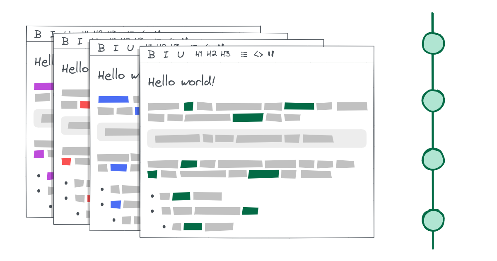

> 원문: https://dio.la/article/lexical-state-updates
>
> 이 포스팅은 원문 저자의 허락을 받아 번역 후 게시되었습니다.



[Lexical](https://lexical.dev/)[^1]은 인기있는 JavaScript 텍스트 에디터 프레임워크다.

상태(_state_) 업데이트는 Lexical의 핵심 개념 중 하나인데, Lexical에서 매우 독특한 방식으로 다뤄진다. 이 글에선 Lexical에서 상태 업데이트가 어떻게 동작하는 지 밝혀본다.

얻게 될 것: Lexical 사용자는 Lexical을 더 깊게 이해해서 더 좋은 텍스트 에디터를 만들 수 있음. Lexical 사용자가 아니라도 유용한 Javascript 테크닉을 하나 알게 됨.

# 업데이트란 뭘까?

Lexical 상태(`EditorState`)에는 중요한 데이터가 두 가지 있다: 현재 **노드 트리** 그리고 **selection**[^2] **상태**. 에디터 인스턴스(`LexicalEditor`)는 항상 "활성화된(_active_)" 상태(`EditorState`)를 갖는다.

이 상태가 에디터의 진실의 원천(_the source of truth_)이다. (DOM이 원천이 아님.) DOM은 항상 상태로부터 **계산**되며 그 반대로 계산되지 않는다.

멋있게 말해보면:

> view (DOM)는 상태(`EditorState`)의 함수다.


상태가 업데이트되면, Lexical은 이전 상태와 다음 상태 사이의 차이를 계산해서 DOM에 반영한다. 이 과정을 "재조정(_reconciliation_)"이라고 한다.


간단하게 만들어본 예시인데, 이전 상태에선 두 개의 paragraph가 있지만, 다음 상태에는 하나만 있는 상황이다. Lexical은 이 둘을 비교해서 두 번째 paragraph가 없어져야 하는 것을 알게되고, DOM에서 제거한다.

실제로는 많이 다르겠지만, React같은 프로젝트의 "가상 DOM 비교(_diffing_)" 개념과 비슷해 보인다.[^3]

---

Lexical은 여러 상황에서 내부적으로 업데이트를 트리거한다. 몇 가지 예시:

- [사용자가 에디터에 텍스트를 입력할 때](https://github.com/facebook/lexical/blob/12a045e533b19e058d98e609873832cea2e3ac85/packages/lexical/src/LexicalEvents.ts#L600) 처럼 이벤트에 응답할 때.
- `LexicalEditor.focus`가 호출될 때, [selection 상태를 올바르게 설정하려고](https://github.com/facebook/lexical/blob/12a045e533b19e058d98e609873832cea2e3ac85/packages/lexical/src/LexicalEditor.ts#L818).
- [유틸함수 `markAllNodesAsDirty`](https://github.com/facebook/lexical/blob/12a045e533b19e058d98e609873832cea2e3ac85/packages/lexical/src/LexicalUtils.ts#L388) 같은 내부 로직에서.

# `LexicalEditor.update()`

콜백 함수("업데이트 함수")를 `LexicalEditor.update` 메서드에 넘겨서 직접 상태를 업데이트할 수도 있다. 공식 문서의 예시:

```ts twoslash
import {
  createEditor,
  $getRoot,
  $getSelection,
  $createParagraphNode,
  $createTextNode,
} from "lexical";
const config = {
  namespace: "MyEditor",
  theme: {},
  onError: console.error,
};
const editor = createEditor(config);
// ---cut---
editor.update(() => {
  // EditorState에서 RootNode를 가져옴.
  const root = $getRoot();

  // 새로운 ParagraphNode를 생성.
  const paragraphNode = $createParagraphNode();

  // 새로운 TextNode를 생성.
  const textNode = $createTextNode("Hello world");

  // TextNode를 paragraphNode에 추가함.
  paragraphNode.append(textNode);

  // 마지막으로, paragraph를 root에 추가함.
  root.append(paragraphNode);
});
```

**프로그래밍 방식으로(_programatically_) 상태를 업데이트**할 수 있는 건 Lexical에서 가장 중요한 기능 중 하나다.

예를 들어서 "이미지"나 "비디오" 같은 노드를 추가해주는 "삽입" 버튼을 만들려면, 클릭 시 상태를 업데이트 하도록 만들어야 한다.\*

> \* 실제로 구현한다면 "삽입" 커맨드를 디스패치하는 방식일 텐데, 이 때는 커맨드 리스너가 상태를 업데이트하게 된다.

---

위의 코드 예시를 보면 몇 가지 의문점이 생긴다:

> - 리턴하는 것도 없고, `setState` 함수 같은 것도 호출하지 않았는데요.
>
>   **업데이트한 상태는 어떻게 저장되는 거에요?**
>
> - 앱에 로드된 다른 에디터 인스턴스가 있을 수 있잖아요.
>
>   **`$getRoot()`는 루트 노드를 어떤 에디터에서 가져올지 어떻게 아는 거죠?**
>
> - _...이거 PHP에요? jQuery인가?!?_
>
>   **`$` 메서드들은 뭐에요?**

곧 답을 알려 줄 테니, 차근차근 시작해보자. (스포일러: _모두 렉시컬 스코프와 관련이 있음_)

# 업데이트 라이프사이클

쉽게 생각하면 상태는 "업데이트"되거나 "변경"되는 것이다. 개념적으로는 그렇게 되는게 맞긴하다.

실제로는 에디터 인스턴스의 상태는 *업데이트*되는 게 아니라 새로운 상태로 *대체*된다. 에디터 상태는 기본적으로는 불변(_immutable_)하며 바로 변경(_alter_)할 수 없다.

---

업데이트는 대략 다음 단계로 이루어진다:

export const CurrentState = () => (
  <span class="font-bold text-green-700">현재 상태</span>
);

export const PendingState = () => (
  <span class="font-bold text-orange-700">대기 상태</span>
);

export const UpdateFunction = () => (
  <span class="font-bold text-blue-700">업데이트 함수</span>
);

export const mutable = <span class="font-bold text-green-500">✔</span>;

export const lock = "🔒";

- {<CurrentState />}가 **복제**되고, 이 복제된 상태가 "{<PendingState />}(_pending state_)"가 됨
- {<PendingState />}가 {mutable} **변경 가능**(_mutable_)하게 됨
- {<UpdateFunction />}가 {<PendingState />}에 **변경 사항**을 적용
- {<UpdateFunction />}가 완료되면, {<PendingState />}가 {lock} **잠김** (변경 불가능한 상태가 됨)
- 재조정(_reconciliation_)이 일어나고, 결과적인 변경 사항이 DOM에 반영됨
- {<PendingState />}가 {<CurrentState />}가 되면서 실질적으로 대체 함

---

이걸로는 답이 되기 좀 모자라지만, 여기서 힌트는 얻을 수 있다: 업데이트 함수가 실행되는 동안은 대기 상태를 변경할 수 있다는 것.

이제 대기 상태를 변경하는 게 가능하다는 건 알겠는데, _어떤식으로_ 그게 가능한 건지는 아직 모르겠다.

# 업데이트의 해부

Lexical에서 [업데이트를 실행하는 메서드](https://github.com/facebook/lexical/blob/12a045e533b19e058d98e609873832cea2e3ac85/packages/lexical/src/LexicalUpdates.ts#L882)를 간단한 버전으로 만들어 보면서, 어떤 일이 일어나는 지 명확하게 이해해보자. `LexicalEditor.update()`는 내부적으로 이 메서드를 호출한다.

기본적인 구현은 다음과 같다:

```ts twoslash
import type { LexicalEditor } from "lexical";
import { cloneEditorState } from "lexical/LexicalEditorState";

let isReadOnlyMode = true;
declare function commitPendingUpdates(editor: LexicalEditor): void;
// ---cut---
function updateEditor(editor: LexicalEditor, updateFn: () => void) {
  // 현재 상태를 가져옴
  const currentEditorState = editor._editorState;
  //    ^?

  // 현재 상태를 복제해서 대기 상태로 설정
  editor._pendingEditorState = cloneEditorState(currentEditorState);

  // 변경 가능하게 설정
  isReadOnlyMode = false;

  // 업데이트 함수를 실행
  updateFn();

  // 변경 불가능하게 설정
  isReadOnlyMode = true;

  // 대기 중인 업데이트를 커밋
  commitPendingUpdates(editor);
}
```

두 가지 단계로 나눠볼 수 있다:

1. **업데이트 단계:** 상태가 복제되고 업데이트 함수가 실행된다.
2. **커밋 단계:** 재조정이 일어나고, 새로운 상태로 이전 상태를 대체한다.

> **재조정**은 대기 상태와 현재 상태를 비교해서, 필요한 변경 사항을 DOM에 적용하는 과정이다.

두 번째 단계는 전부 `commitPendingUpdates`의 내부에서 이루어진다. 이 함수를 정말 간단하게 나타내면 다음과 같다:

```ts twoslash
import type { LexicalEditor, EditorState } from "lexical";
declare function reconcileDOM(
  currentState: EditorState,
  pendingState: EditorState
): void;
// ---cut---
function commitPendingUpdates(editor: LexicalEditor) {
  // 현재 상태를 가져옴
  const currentState = editor._editorState;

  // 대기 상태를 가져옴
  const pendingState = editor._pendingEditorState!;

  // DOM 재조정
  reconcileDOM(currentState, pendingState);

  // 대기 상태를 현재 상태로 설정
  editor._editorState = pendingState;
}
```

# 렉시컬 스코프

위에서 한 가지 주목해야 할 건 `isReadOnlyMode`인데, 얘는 어디서 온걸까?

간단하다. 모듈 수준(_module level_)에서 정의되어 있다. `LexicalUpdates.ts` 모듈에는 `isReadOnlyMode` 변수 선언과 `updateEditor` 함수가 모두 들어있다:

```ts twoslash {1, 5, 7}
import type { LexicalEditor } from "lexical";
// ---cut---
let isReadOnlyMode = true;

export function updateEditor(editor: LexicalEditor, updateFn: () => void) {
  // ...
  isReadOnlyMode = false;
  // ...
  isReadOnlyMode = true;
}
```

이렇게 정의하면 **렉시컬 스코프** 덕분에 유용하다.

> **웃긴 사실!**
>
> Lexical은 원래 "Outline"이라는 이름이었는데, 중간에 "Lexical"로 이름을 바꿨다. JavaScript 렉시컬 스코프를 참고한 것 이다.
>
> 이 아이디어를 떠올린 Dominic Gannaway가 말하길:
>
> "이게 바로 이 프로젝트를 Lexical이라고 부르는 이유입니다. 두 가지 의미가 있는 거죠. Lexical의 핵심적인 동작들이 렉시컬 스코프를 통해 이루어진다는 것, 또 Lexical이라는 단어의 뜻처럼 언어와 어휘에 대한 프로젝트인 점을 의미하는 거에요."
>
> 렉시컬 스코프 개념이 익숙하지 않다면, 이어서 읽기 전에 [이걸 먼저 배우고 오자](https://developer.mozilla.org/en-US/docs/Glossary/Scope).

특히 Lexical은 *모듈 스코프*를 활용한다. 변수가 선언된 모듈 어디서든 그 변수에 접근할 수 있다는 점을 활용한다는 의미다.

그런데 흥미로운 점이 하나 있다. Lexical을 사용해봤다면, `LexicalEditor.update()` 콜백 **외부에서** `node.insertAfter()` 같은 메서드를 호출하려다가 다음과 같은 에러를 봤을지도 모른다:

```ts twoslash
import type { NodeKey } from "lexical";
import { createEditor, $getNodeByKey, $createParagraphNode } from "lexical";

const config = {
  namespace: "MyEditor",
  theme: {},
  onError: console.error,
};
const editor = createEditor(config);
declare const key: NodeKey;
const node = $getNodeByKey(key)!;
const paragraph = $createParagraphNode();
// ---cut---
// 이건 잘 동작함
editor.update(() => {
  node.insertAfter(paragraph);
});

// 이건 실패함
node.insertAfter(paragraph);
// error: "Cannot use method in read-only mode"
```

`insertAfter`는 읽기 전용 모드(_read-only mode_) 상태를 어떻게 아는 걸까? `insertAfter`는 `isReadOnlyMode`와 같은 파일에서 선언된 적 없다. 어떻게 동작하는 걸까?

이제 정답에 거의 다 왔다.

## 업데이트는 동기적으로 동작한다

`updateEditor`를 다시 한 번 보자. 이 함수는 동기적(_synchronous_)이므로 우리는 연산 순서를 확신할 수 있다. 좀 더 설명해보면:

```ts twoslash
import type { LexicalEditor } from "lexical";
// ---cut---
let isReadOnlyMode = true;

export function updateEditor(editor: LexicalEditor, updateFn: () => void) {
  console.log(isReadOnlyMode); // > true

  isReadOnlyMode = false;
  console.log(isReadOnlyMode); // > false

  isReadOnlyMode = true;
  console.log(isReadOnlyMode); // > true
}
```

단순하지만 중요한 부분! 여기서 핵심은 업데이트 콜백이 호출될 때까지는 `isReadOnlyMode`가 `false`라는 것. 대기 상태가 실제로 변경 가능한 상태라는 의미다:

```ts twoslash {4-5}
import type { LexicalEditor } from "lexical";
// ---cut---
let isReadOnlyMode = true;

export function updateEditor(editor: LexicalEditor, updateFn: () => void) {
  isReadOnlyMode = false;
  updateFn(); // 이 함수가 실행되는 동안에는 isReadOnlyMode가 false
  isReadOnlyMode = true;
}
```

## 모듈 스코프는 외부에서 접근할 수 있다

모듈은 `export` 문을 통해 외부로 값을 노출할 수 있다. 이게 결국 모듈의 목적인 것!

```twoslash include module-one
// @module: esnext
// @filename: module-one.ts
const privateConst = "my constant";
let privateLet = "my variable";

function privateFunction() {
  // ...
}

export const publicConst = "my public constant";
export let publicLet = "my public variable";
export function publicFunction() {
  // ...
}
```

```ts twoslash
// @include: module-one
```

**공개**(_public_) 모듈은 이런 식으로 임포트(_import_)할 수 있다:

```ts twoslash
// @include: module-one
// ---cut---
// @filename: module-two.ts
import { publicConst, publicLet, publicFunction } from "./module-one";
```

**내보내지 않은**(_not exported_) 값은 "**비공개**(_private_)"다. 다른 모듈에서 임포트할 수 없다.

```ts twoslash
// @errors: 2459
// @include: module-one
// ---cut---
// @filename: module-two.ts
import { privateConst, privateLet, privateFunction } from "./module-one";
```

---

`isReadOnlyMode` 변수를 다시 살펴보자. 이 변수는 내보내지지 않았기 때문에 다른 모듈에서 직접 사용할 수는 없다:

```ts twoslash {2, 7, 10-12}
// @errors: 2459
// @filename: LexicalUpdates.ts
let isReadOnlyMode = true; // "export" 키워드가 없다!

export function updateEditor() {}

// @filename: a-module-somewhere.ts
import { isReadOnlyMode } from "./LexicalUpdates";

function $mutateStateSomehow() {
  if (isReadOnlyMode) {
    throw new Error("Cannot use method in read-only mode");
  }
}
```

그래도 모듈 내부에서 이 변수를 반환하는 함수를 만드는 건 가능하다. Lexical에서 사용하는게 이런 패턴이다:

```ts twoslash {4-6, 9, 12-14}
// @filename: LexicalUpdates.ts
let isReadOnlyMode = true;

export function isCurrentlyReadOnlyMode(): boolean {
  return isReadOnlyMode;
}

// @filename: a-module-somewhere.ts
import { isCurrentlyReadOnlyMode } from "./LexicalUpdates";

function $mutateStateSomehow() {
  if (isCurrentlyReadOnlyMode()) {
    throw new Error("Cannot use method in read-only mode");
  }
}
```

Lexical에서는 아예 `isReadOnlyMode` 값을 확인하고 에러를 던져주는 용도로 함수를 만들어 내보낸다:

```ts twoslash {4-8, 11, 14}
// @noErrors
// @filename: LexicalUpdates.ts
let isReadOnlyMode = true;

export function errorOnReadOnly(): void {
  if (isReadOnlyMode) {
    throw new Error("Cannot use method in read-only mode.");
  }
}

// @filename: a-module-somewhere.ts
import { errorOnReadOnly } from "./LexicalUpdates";

function $mutateStateSomehow() {
  errorOnReadOnly();
}
```

## 모듈 스코프 + 동기적 실행 = 성공적

이제 지금까지 나온 개념들을 연결해보자!

이전 섹션에서 만든 `$mutateStateSomehow` 함수는 호출되면, `LexicalUpdates.ts` 모듈의 `isReadOnlyMode` 값을 확인합니다.

이 함수는 `updateEditor` 내부에서 (보통 `LexicalEditor.update()`을 통해서) 호출해야 한다. 예시:

```ts twoslash
import {
  createEditor,
  $getRoot,
  $getSelection,
  $createParagraphNode,
  $createTextNode,
} from "lexical";
const config = {
  namespace: "MyEditor",
  theme: {},
  onError: console.error,
};
const editor = createEditor(config);
function $mutateStateSomehow() {}
// ---cut---
editor.update(() => {
  $mutateStateSomehow();
});
```

우리가 전달한 업데이트 콜백은 동기적으로 실행되고, `isReadOnlyMode` 바로 앞에서 실행되는 것을 기억하자:

```ts twoslash {4-5}
import type { LexicalEditor } from "lexical";
// ---cut---
let isReadOnlyMode = true;

export function updateEditor(editor: LexicalEditor, updateFn: () => void) {
  isReadOnlyMode = false;
  updateFn(); // $mutateStateSomehow는 여기서 실행 됨
  isReadOnlyMode = true;
}
```

즉, `$mutateStateSomehow`가 호출될 때는 `isReadOnlyMode`가 `false`일 것이고, 에러가 발생하지 않을 것이다.

---

이제 Lexical이 이런 (동기적 실행과 모듈 스코프의)동작 방식을 어떤 식으로 똘똘하게 활용하는 지 알아볼 준비가 끝났다.

Lexical은 에디터가 특정 시점에 읽기 전용 모드인지를 확인하는 데에 이 패턴을 사용한다. 이 패턴으로 일종의 "전역 상태"를 만들어낸다. 에디터 상태를 변경하려는 함수들은 이 방식으로 `isReadOnlyMode`값을 확인하는 것이다.

이제 마지막 질문은 답을 할 수 있다:

> **이 `$` 메서드들은 뭐에요?**
>
> `$` 접두사는 `LexicalUpdate.ts`의 렉시컬 스코프에 의존하는 함수를 의미하는 Lexical의 컨벤션입니다. 따라서 `LexicalEditor.update()` (또는 `EditorState.read()`!) 콜백에서만 호출할 수 있습니다.

Lexical 패키지에는 `$` 함수들이 많이 있습니다. 예를 들어, `lexical` 패키지에서 내보내는 `$` 함수들은 다음과 같습니다:

{/* prettier-ignore-start */}
```ts twoslash
// @noErrors
 import { $ } from "lexical";
//         ^|
```
{/* prettier-ignore-end */}

<div class="h-36" />

Lexical로 작업할 때, 직접 만든 함수에 이 컨벤션을 사용하는 것도 좋습니다. `$` 함수를 호출하는 함수를 만들면, 그 함수도 `$`로 접두사를 붙인다고 생각하면 대충 맞습니다.[^4]

## 활성 에디터와 상태

Lexical은 어떤 **에디터**와 **에디터 상태**가 활성(_active_) 중 인지 (현재 작업 대상인지) 찾는데에 동일한 테크닉을 사용합니다.

```ts twoslash {2-3, 9, 20, 34-35, 42-43}
import type { EditorState, LexicalEditor } from "lexical";
import { cloneEditorState } from "lexical/LexicalEditorState";
declare function commitPendingUpdates(editor: LexicalEditor): void;
// ---cut---
let isReadOnlyMode = true;
let activeEditorState: null | EditorState = null;
let activeEditor: null | LexicalEditor = null;

export function isCurrentlyReadOnlyMode(): boolean {
  return isReadOnlyMode;
}

export function getActiveEditorState(): EditorState {
  if (activeEditorState === null) {
    throw new Error(
      "Can only be used in the callback of" +
        "editor.update() or editorState.read()"
    );
  }

  return activeEditorState;
}

export function getActiveEditor(): LexicalEditor {
  if (activeEditor === null) {
    throw new Error("Can only be used in the callback of editor.update()");
  }

  return activeEditor;
}

export function updateEditor(editor: LexicalEditor, updateFn: () => void) {
  const currentEditorState = editor._editorState;
  editor._pendingEditorState = cloneEditorState(currentEditorState);

  // 렉시컬 스코프의 변수들에 값을 설정합니다.
  isReadOnlyMode = false;
  activeEditor = editor;
  activeEditorState = editor._pendingEditorState;

  // 업데이트 콜백을 실행합니다.
  updateFn();

  // 렉시컬 스코프의 변수들을 초기화합니다.
  isReadOnlyMode = true;
  activeEditor = null;
  activeEditorState = null;

  // 대기 중인 업데이트를 커밋합니다.
  commitPendingUpdates(editor);
}
```

이로써 남은 질문들도 답을 할 수 있게 됐습니다:

> **업데이트한 상태는 어떻게 저장되는 거에요?**
>
> 대기 상태는 `activeEditorState`에 저장됩니다. 이 상태는 `LexicalEditor.update()` 콜백이 실행되는 동안 변경 가능(_mutable_)하므로 수정할 수 있습니다. 나중에 `commitPendingUpdates`가 현재 상태를 대기 상태로 대체해서, 실질적으로 "저장"합니다.

> **`$getRoot()`는 루트 노드를 어떤 에디터에서 가져올지 어떻게 아는 거죠?**
>
> `LexicalEditor.update()`가 호출될 때 에디터 인스턴스는 `activeEditor`에 저장됩니다. 이렇게 하면 `$getRoot()` 같은 함수가 (`getActiveEditor()`를 통해) 그 인스턴스에 접근할 수 있게 됩니다.

# `EditorState.read()`

상태를 변경하지 않고 읽기만 하고 싶을 때도 있을 겁니다.

모듈 스코프에 의존하기 때문에, `updateEditor`처럼 렉시컬 스코프를 설정해주는 [`readEditorState` 함수](https://github.com/facebook/lexical/blob/a0d5e95ec0371dae915b5c000e2bc68f029644d3/packages/lexical/src/LexicalUpdates.ts#L391-L410) 가 필요합니다. 이 함수는 다음과 같습니다:

```ts twoslash
import type { LexicalEditor, EditorState } from "lexical";

let isReadOnlyMode = true;
let activeEditorState: null | EditorState = null;
let activeEditor: null | LexicalEditor = null;
// ---cut---
export function readEditorState<V>(
  editorState: EditorState,
  callbackFn: () => V
): V {
  const previousActiveEditorState = activeEditorState;
  const previousReadOnlyMode = isReadOnlyMode;
  const previousActiveEditor = activeEditor;

  activeEditorState = editorState;
  isReadOnlyMode = true;
  activeEditor = null;

  const result = callbackFn();

  activeEditorState = previousActiveEditorState;
  isReadOnlyMode = previousReadOnlyMode;
  activeEditor = previousActiveEditor;

  return result;
}
```

> 위 코드는 쉽게 이해하기위해 간단하게 만든 버전이고, 실제 함수에서의 패턴은 다릅니다. 이에 대한 글입니다:
>
> [Try, return, finally: a curious JavaScript pattern](https://dio.la/article/try-return-finally)

# 커밋 스케줄링과 배칭

업데이트의 커밋 단계(`commitPendingUpdates`)는 기본적으로 [마이크로태스크(_microtask_)로 스케줄링](https://github.com/facebook/lexical/blob/a0d5e95ec0371dae915b5c000e2bc68f029644d3/packages/lexical/src/LexicalUpdates.ts#L950)되어 있습니다. 즉, 다른 동기적인 코드의 실행이 모두 끝나야 커밋이 일어납니다.

연속해서 여러 업데이트를 동기적으로 실행하면, 결과 상태는 (현재 틱이 끝날 때) 한 번만 커밋됩니다.

중첩된(_nested_) 업데이트에서도 마찬가지 입니다. 중첩된 업데이트는 다른 업데이트의 실행 중에 만들어진 업데이트를 의미합니다. 다시 말해서 `LexicalEditor.update()` 호출에서 다른 `LexicalEditor.update()` 콜백을 호출하는 경우입니다.

예시를 보겠습니다:

```ts twoslash
import { createEditor } from "lexical";
const config = {
  namespace: "MyEditor",
  theme: {},
  onError: console.error,
};
const editor = createEditor(config);
// ---cut---
editor.update(() => {}); // A
// > 업데이트 A가 실행됩니다

editor.update(() => {}); // B
// > 업데이트 B가 실행됩니다

editor.update(() => {}); // C
// > 업데이트 C가 실행됩니다

// (다른 동기적인 코드가 실행됩니다...)

// --- 동기적인 코드가 실행을 마칩니다 ---

// > 업데이트 A, B, C가 커밋됩니다
```

이전 섹션들에서 배운 업데이트 아키텍처 덕분에 이런 일이 가능한 것 입니다.

여러 업데이트가 동기적으로 일어나면, 모두 같은 대기 상태를 연쇄적으로 업데이트합니다. 개념적으로, 첫 번째 업데이트의 출력이 두 번째 업데이트의 입력이 되는 식입니다.

모든 업데이트가 끝나면, 대기 상태가 커밋되고, 에디터 상태가 대체됩니다. 재조정은 무거워 질 수 있는 프로세스이므로 이런 배칭은 중요한 성능 최적화입니다.

## 개별적인(_discrete_) 업데이트[^5]

보통은 커밋 스케줄링과 배칭이 우리가 원하는게 맞지만, 방해가 되는 경우도 있습니다.

예를 들어서 서버 환경에서 에디터 상태를 조작하고, 그 상태를 데이터베이스에 저장하는 경우를 생각해봅시다.

```ts twoslash
import { createEditor, SerializedEditorState } from "lexical";
const config = {
  namespace: "MyEditor",
  theme: {},
  onError: console.error,
};
const editor = createEditor(config);
declare function saveToDatabase(editorState: SerializedEditorState): void;
// ---cut---
editor.update(() => {
  // 상태를 조작합니다...
});

saveToDatabase(editor.getEditorState().toJSON());
```

이 코드는 기대한 대로 동작하지 않습니다. `saveToDatabase` 호출이 끝나고 상태가 커밋되기 때문입니다. 업데이트 이전의 상태가 저장될 것 입니다.[^6]

다행히도, `discrete: true` 옵션으로 `LexicalEditor.update`가 업데이트를 즉시 커밋하도록 강제 할 수 있습니다.

```ts twoslash {5}
import { createEditor, SerializedEditorState } from "lexical";
const config = {
  namespace: "MyEditor",
  theme: {},
  onError: console.error,
};
const editor = createEditor(config);
declare function saveToDatabase(editorState: SerializedEditorState): void;
// ---cut---
editor.update(
  () => {
    // 상태를 조작합니다...
  },
  { discrete: true }
);

saveToDatabase(editor.getEditorState().toJSON());
```

이제 제대로 동작합니다!

# 결론

Lexical에서 업데이트가 어떻게 동작하는지 이해하니까 정말 편하게 작업할 수 있었습니다.

Lexical을 처음 접했을 땐, `$` 함수 접두사 같은 것은 것들이 무섭고 모호하다고 느꼈어요. 업데이트가 언제, 어떻게 적용되는지 확신할 수 없어서 눈앞이 캄캄했습니다.

한번 이해가 되니까, 버그가 나와도 원인을 찾고 수정하는 일이 훨씬 수월했습니다.

이 글이 업데이트를 이해하는 데 도움이 되었으면 좋겠어요. Lexical에 관한 더 많은 글을 기대해주세요!

---

보너스! Lexical 메인테이너들에게 받은 피드백:

> - "진짜 잘썼네요." - Dominic Gannaway
> - "너무 좋아요 Dani! 정리해 줘서 고마워요! (예제 상호작용도 최고임). 제가 보기엔 매우 정확하고 좋은 글입니다." - John Flockton

---

## 역자 주

[^1]: 라이브러리을 지칭하는 경우 "_Lexical_", Javascript의 문법적 개념을 지칭하는 경우 "_렉시컬_"로 표기합니다.
[^2]: Lexical 에디터에서 선택된 범위나 노드 등의 데이터를 위한 객체 - [Lexical 문서](https://lexical.dev/docs/concepts/selection)
[^3]: 참고 - [React 레거시 문서](https://legacy.reactjs.org/docs/reconciliation.html)
[^4]: [v0.15.0](https://github.com/facebook/lexical/releases/tag/v0.15.0) 부터 `$` 규칙에 대한 eslint 플러그인이 지원됩니다.
[^5]: 이 옵션이 추가된 PR - [@facebook#3119](https://github.com/facebook/lexical/pull/3119)
[^6]: `onUpdate` 콜백을 이용한 다른 해결방법 - [@facebook#5664 (comment)](https://github.com/facebook/lexical/pull/5664/files#r1506725901)
