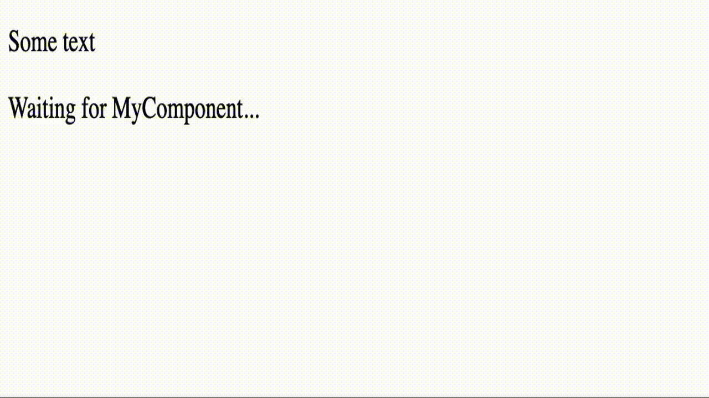
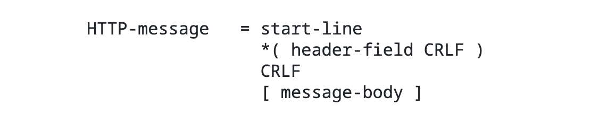
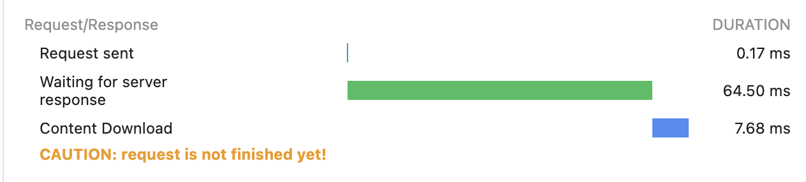
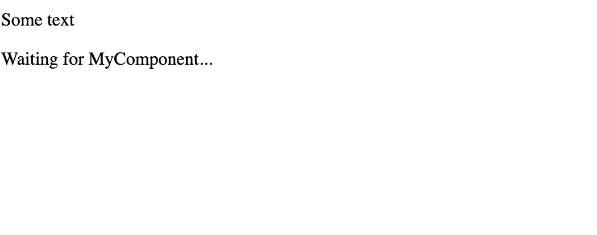
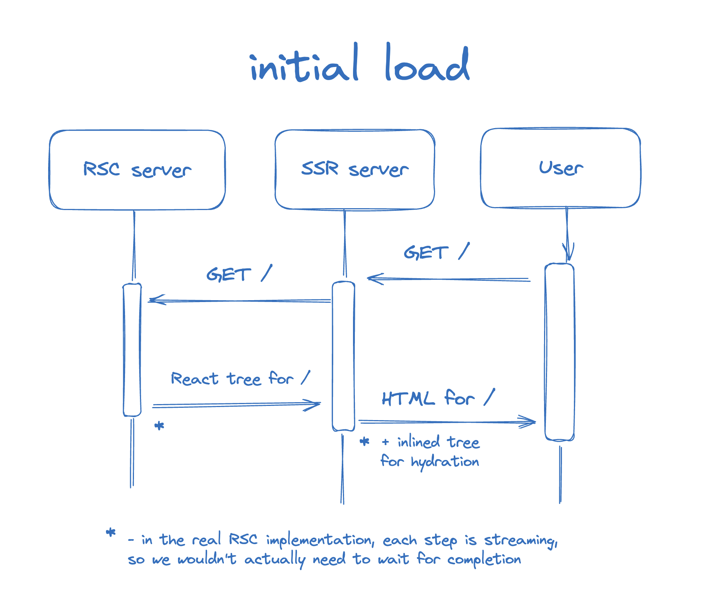
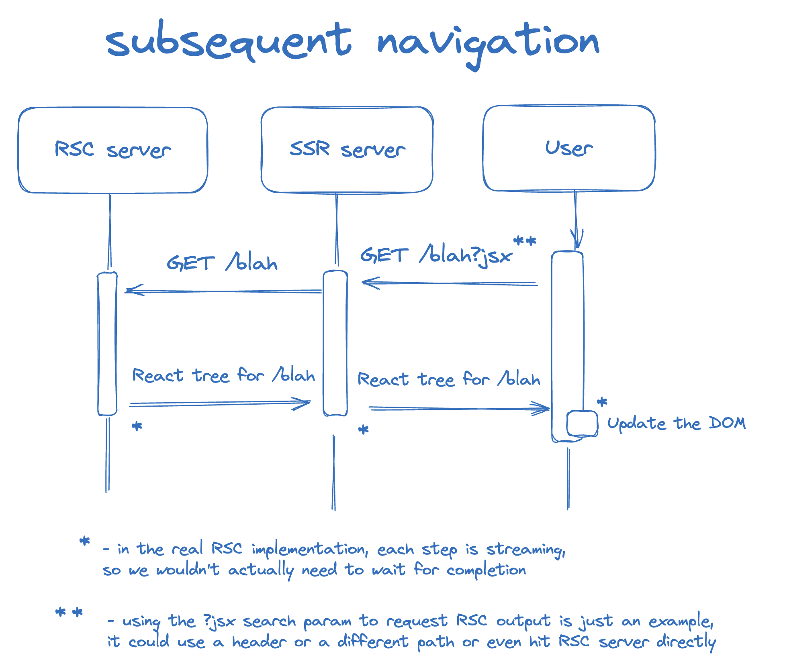

## Table of contents

## Nextjs App Router

> Nextjs 앱 라우터가 페이지 라우터랑 다른점이 뭐에요?

면접에서 이 질문을 받는다면, 가장 큰 차이점은 앱 라우터의 RSC(React Server Components) 지원이라고 할 것 같다.

- RSC의 지원으로 서버사이드의 로직을 컴포넌트 수준으로 추상화할 수 있다.
- 그리고 비동기적인 렌더링 로직을 모두 마치기 전에 Streaming 할 수 있다.

```tsx twoslash
// @noErrors
// ---cut---
import { Suspense } from "react";

function wait<T>(ms: number, data: T) {
  return new Promise<T>(resolve => {
    setTimeout(() => resolve(data), ms);
  });
}

async function MyComponent() {
  const data = await wait(1000, { name: "Wonhee" });
  return <p>{data.name}</p>;
}

export default async function Home() {
  return (
    <>
      <p>Some text</p>
      <Suspense fallback={"Waiting for MyComponent..."}>
        <MyComponent />
      </Suspense>
    </>
  );
}
```



이를 통해서 직관적인 개발경험과 부드러운 유저경험을 모두 얻을 수 있다.

> 근데 이거 어떻게 동작하는 거지...?

## HTTP Streaming

### HTTP message format

우리가 익숙한 HTTP 응답은 이런 식이다.

User Agent(브라우저, curl, ...)가 서버에게 요청을 보내면, 서버가 응답을 준다.

export const commonHttpResponse = `HTTP/1.1 200 OK␍␊
Date: Mon, 27 Jul 2009 12:28:53 GMT␍␊ 
Content-Length: 12␍␊
Content-Type: text/plain␍␊
␍␊  
Hello World!`;

<Code code={commonHttpResponse} lang="http" />

첫 줄 `HTTP/1.1 200 OK␍␊`은 상태코드 200으로 정상 응답이 왔다는 뜻이다.

그 다음 세 줄은 헤더인데, 지금 예시에선 `Date`, `Content-Length`, `Content-Type` 헤더들이 `:` 로 구분되는 `key-value` 쌍으로 이뤄져 있다.

여기서 각 줄의 마지막 `␍␊` 은 각 헤더의 끝을 나타내는 줄바꿈이고, 마지막 줄의 `␍␊` 는 헤더와 바디를 구분하는 줄바꿈이다.


_HTTP message format - [RFC 7230](https://datatracker.ietf.org/doc/html/rfc7230#section-3)_

이제 이 다음에 message body 에 해당하는 content가 올 텐데, 브라우저는 헤더를 보고

1. 12 바이트 길이의 content 를 다운로드 해야 함 (`Hello World!` => 12 bytes)
2. 12 바이트가 다운로드 되면(= `fetch` promise 가 resolve 됨) content를 보여줄 수 있음

을 알 수 있다.

### Transfer-Encoding: chunked

그런데 서버에서 `Content-Length` 헤더없이 응답을 보낸다면?

`Content-Length`가 없으면 HTTP 서버들은 암묵적으로 `Transfer-Encoding: chunked` 헤더를 추가한다.
이런 헤더가 달린 응답이오면,

> "나 서번데, 얼마나 보낼지는 모르겠고, chunk 단위로 잘라 보낸다"

라고 브라우저는 받아들인다.

실제로 전송받는 응답을 보면,

export const streamHttpResponse1 = `HTTP/1.1 200 OK␍␊
Date: Mon, 27 Jul 2009 12:28:53 GMT␍␊
Transfer-Encoding: chunked␍␊ // [!code highlight]
Content-Type: text/plain␍␊
␍␊
5␍␊      // [!code highlight]
Hello␍␊  // [!code highlight]`;

<Code code={streamHttpResponse1} lang="http" />

지금 메세지를 전부가 아닌 5바이트만 받은 상황이다.

포맷을 보면

1. chunk 사이즈를 먼저 받고
2. 그 사이즈 만큼의 content를 chunk 로 받는다.
3. `␍␊` 로 끝난다.

export const streamHttpResponse2 = `HTTP/1.1 200 OK␍␊
Date: Mon, 27 Jul 2009 12:28:53 GMT␍␊
Transfer-Encoding: chunked␍␊
Content-Type: text/plain␍␊
␍␊
5␍␊
Hello␍␊
7␍␊       // [!code highlight]
 World!␍␊ // [!code highlight]`;

<Code code={streamHttpResponse2} lang="http" />

두번째 chunk 로 7바이트를 받았다.

`Hello␍␊` 이후 7바이트를 받기전 몇 초간 브라우저는 어떤 상태일까?

브라우저는 연결을 유지하고 다음 chunk 를 기다린다.



... 서버는 응답이 끝났다고 한 적이 없다.

브라우저가 응답이 끝났다고 판단하는 기준은 뭘까?

> "서버가 `0␍␊` 를 보낼 때"

0바이트를 보내겠다 = 더 보낼게 없다. `0␍␊` 를 받으면 응답이 끝났다고 판단한다.

export const streamHttpResponse3 = `HTTP/1.1 200 OK␍␊
Date: Mon, 27 Jul 2009 12:28:53 GMT␍␊
Transfer-Encoding: chunked␍␊
Content-Type: text/plain␍␊
␍␊
5␍␊
Hello␍␊
7␍␊
 World!␍␊
0␍␊      // [!code highlight]
␍␊       // [!code highlight]`;

<Code code={streamHttpResponse3} lang="http" />

그럼 `Content-Length: <number>` 헤더가 있으면 데이터는 항상 한번에 다 전송되는 건가?

아니다. 어차피 HTTP 아래의 TCP/IP 같은 프로토콜에서 데이터가 여러 패킷으로 전송된다.

`Transfer-Encoding: chunked` 헤더가 있으면, HTTP 수준에서 더 명시적으로 데이터 전송을 제어하는 점이 다른 것이다.

전체 크기를 모르는 데이터를 전송 중에 동적으로 렌더링을 시작하는 등 유연한 처리가 가능해진다.

참고로 두 헤더를 동시에 적용할 수는 없다. `Content-Length` 가 무시된다.

> "Messages MUST NOT include both a Content-Length header field and a non-identity transfer-coding. If the message does include a non-identity transfer-coding, the Content-Length MUST be ignored." <br/> - [RFC 2616](https://greenbytes.de/tech/webdav/rfc2616.html#rfc.section.4.4.p.5)

## Nextjs 에서의 Streaming

### \<Suspense />

Nextjs 에서는 이런 Streaming 을 \<Suspense /> 와 함께 사용한다.

서스펜스. 영화와 관련된 단어로 익숙한 단어다.

> "There is no terror in the bang, only in the anticipation of it." <br/> - Alfred Hitchcock

대충 갑자기 놀래키는 것보다 예상하고 있을 때 관객이 더 집중하게 되고, 상상력을 자극한다는 히치콕 아저씨의 명언이다.

UX에서도 비슷하다. UI가 갑자기 빵하고 나타나는 대신, 스켈레톤 UI를 통해서 등장을 예고하며 유저의 관심을 끈다. 유저가 서비스에 계속 집중하게 하고 혼란스러운 경험을 줄여준다.

아무튼 Nextjs에서는 \<Suspense />를 사용해서 Streaming UI를 구현하게 된다.

```tsx twoslash {5-7}
// @noErrors
import { Suspense } from "react";

async function MyComponent(): Promise<React.JSX.Element> {
  throw new Error("Not implemented");
}

// ---cut---
export default async function Home() {
  return (
    <>
      <p>Some text</p>
      <Suspense fallback={"Waiting for MyComponent..."}>
        <MyComponent />
      </Suspense>
    </>
  );
}
```

서버에서는 \<MyComponent />를 렌더링하는동안 fallback을 먼저 보낸다.



브라우저의 `네트워크 > 응답` 탭을 가보면,

\<MyComponent/> chunk 가 도착하기 전까지 화면에 보여지고 있는 html 문서가 있다.

import streamHtml1 from "./streamHtml1.html?raw";

<Code code={streamHtml1} lang="html" />

브라우저들은 유효하지 않은 html 을 받아도, 에러를 띄우지 않고 최선을 다해서 렌더링한다.

> One of the important maxims of computer programming is: "Be conservative in what you produce; be liberal in what you accept."
>
> Browsers follow the second half of this maxim by accepting Web pages and trying to display them even if they're not legal HTML. <br/> <br/> - [W3C Validator Help & FAQ](https://validator.w3.org/docs/help.html#why-validate)

Streaming 동안 닫는 태그의 chunk 를 받지 않았어도, 에러없이 화면에 보여준다.

화면에 보여지는 fallback UI는 아래의 세그먼트로

import htmlSegment1 from "./htmlSegment1.html?raw";

<Code code={htmlSegment1} lang="html" />

`"B:0"` id를 갖는 \<template /> 와 fallback UI가 함께 주석으로 감싸져있다.

template은 다음 chunk로 전송받을 \<MyComponent /> 를 위한 플레이스 홀더 역할이고, 주석은 그 경계를 의미한다.


\<MyComponent /> chunk 가 도착하면, 이전에 보여지던 fallback UI를 대체한다.

응답을 보면 `$RC` 라는 함수를 호출하는 스크립트를 통해 이 과정이 이뤄지는 것으로 보인다.

import streamHtml2 from "./streamHtml2.html?raw";

<Code code={streamHtml2} lang="html" />

`$RC`의 정체는 [`completeBoundary`](https://github.com/facebook/react/blob/b9be4537c2459f8fc0312b796570003620bc8600/packages/react-dom-bindings/src/server/fizz-instruction-set/ReactDOMFizzInstructionSetShared.js#L46):

1. suspenseBoundaryId `"B:0"`, contentId `"S:0"` 를 받아서,
2. DOM 에서 suspenseBoundary `<!--$?--> ~ <!--/$-->` 를 전부 제거하고,
3. `div#contentId`의 자식 노드로 갈아끼우는 함수다.

---

정리해보자.

페이지 요청이 들어오면,

1. 서버에서 `Transfer-Encoding: chunked` 헤더가 달린 응답을 브라우저에게 보낸다.
2. 렌더링 중 비동기적인 로직이 있어도, chunk 단위로 렌더링 결과를 스트리밍한다.
3. \<Suspense /> 가 사용된 경우, fallback UI를 플레이스 홀더 역할을 하는 \<template /> 태그와 함께 먼저 보낸다.
4. 아직 `0␍␊` 가 오지 않았으므로 브라우저는 다음 chunk 를 계속 기다린다.
5. \<MyComponent /> chunk 를 받으면, fallback UI를 대체하는 스크립트를 실행한다.
6. 서버가 `0␍␊` 를 보내며 응답이 끝낸다.

이제 Nextjs의 Streaming UI가 어떻게 동작하는지 알았다.

그런데 앱 라우터는 페이지 이동 시 SPA 처럼 동작을 하는데, 그러면서 서버에서 렌더링한 컴포넌트들을 Streaming 한다.

어떤 구조인 거지?

## SPA + SSR

React팀의 Dan Abramovic의 [아티클](https://github.com/reactwg/server-components/discussions/5)을 참고해보자.

<StackBlitz id="2wheeh/streaming-from-scratch" clickToLoad client:load />

_Dan의 아티클의 마지막 예제에서 에러를 수정한 버전_

RSC 지원을 위한 SSR 서버를 최소한의 요구사항으로 구현한 예제다.

예제는 1.페이지 첫 로드의 경우와 2.앱 내에서 페이지 이동이 일어난 경우를 나눠서 처리한다.

- 첫 로드: JSX를 HTML 마크업 문자열로 렌더링한 결과를 응답받는다.
- 앱 내에서 페이지 이동: JSX를 응답받아서 DOM에 업데이트한다.

먼저 클라이언트의 동작을 살펴보면,

### 첫 로드 시 클라이언트 동작

첫 로드시에는 브라우저가 기본 동작대로 해당 url에 대한 요청을 보낸 후 응답으로 받은 html을 DOM에 반영한다.

- 서버에서 html 마크업을 랜더링해서 보내준다.
- 보낼 때, 렌더링에 사용한 JSX 객체를 document에 serialize해서 넣어준다.
- 이 객체를 이용해서 리액트가 hydrate을 수행한다.

import hydrate from "./hydrate.js?raw";

<Code code={hydrate} lang="js" />

### 페이지 이동 시 클라이언트 동작

앱 내에서 페이지를 이동하는 경우는 브라우저의 기본 동작을 가로챈다.

import intercept from "./intercept.js?raw";

<Code code={intercept} lang="js" />

기본 동작 대신, 원래 이동하려던 url 에 `?jsx` 를 붙여서 서버에 요청을 보낸다. 해당 경로에 해당하는 컴포넌트의 JSX가 응답으로 도착하면, 리액트가 diffing 을 통해 변경된 부분만 DOM에 반영한다.

import navigate from "./navigate.js?raw";

<Code code={navigate} lang="js" />

즉, 클라이언트에서는 SPA의 동작을 위해

- 페이지 이동 기본 동작을 가로채고
- 서버에서 해당 경로에 해당하는 컴포넌트 JSX를 받아서
- DOM에 업데이트한다.

DOM에 업데이트하는 과정을 React가 수행한다. 이 덕분에, 공용으로 사용하는 컴포넌트의 경우 상태를 유지하게 된다. (예제의 상단 인풋에 값을 입력하고 페이지를 이동해보면 유지되는 걸 확인 가능)

---

그럼 서버에서는 각 경우에 따른 요청을 어떻게 처리할까?

서버는 SSR 서버와 RSC 서버로 나뉜다.

- SSR 서버: RSC 서버에서 받은 JSX를 그대로 응답하거나, HTML 마크업 문자열로 렌더링해서 응답해주는 서버
- RSC 서버: 컴포넌트의 로직을 연산해서 JSX를 응답해주는 서버

### 첫 로드 시 서버 동작

먼저, 페이지 첫 로드의 경우:

- 브라우저가 url 접근하면서 SSR 서버에게 페이지 요청을 보낸다.
- 요청을 받은 SSR 서버는 페이지 전체를 HTML 문자열로 렌더링해서 응답한다.

import initialResponse from "./initialResponse.js?raw";

<Code code={initialResponse} lang="js" />

- SSR 서버가 RSC 서버에게 컴포넌트 JSX에 해당하는 JSON 객체를 응답받는다.
- 이 객체를 받아서 `renderToString`가 HTML 마크업 문자열로 변환하고, 이를 클라이언트에게 응답한다.

RSC 서버에서는 요청에 따라 해당 경로의 컴포넌트들을 연산해서 JSX를 반환한다:

\<Router /> 를 \<html> ~ \</html> 에 해당하는 객체로 변환

import rscServer from "./rscServer.js?raw";

<Code code={rscServer} lang="js" />

### 페이지 이동 시 서버 동작

페이지 이동 시에는 `?jsx` 가 붙어서 요청이 들어온다.

이 경우 RSC 서버에서 응답받은 JSX 객체를 그대로 내려준다.

import ssrOnPageMove from "./ssrOnPageMove.js?raw";

<Code code={ssrOnPageMove} lang="js" />

정리해보면 다음과 같다:

최초 로드 시에는

- `/` 에 대한 React tree 에 해당하는 JSX 객체를 RSC 서버가 SSR 서버에게 보냄
- SSR 서버에서는 이 객체를 HTML 마크업 문자열로 변환해서 브라우저에 응답



앱 내에서 페이지 이동 시에는

- 브라우저에서 `/어떤경로` 대신 `/어떤경로?jsx` 로 요청을 보냄
- RSC 서버에서는 `/어떤경로`의 JSX 객체를 SSR 서버에게 응답
- SSR 서버에서는 이 객체를 그대로 브라우저에 응답
- 브라우저에서 이 객체를 리액트가 diffing 해서 DOM에 반영



실제 RSC 구현에서는 위에서 살펴본 Streaming을 통해 컴포넌트 단위로 전송된다. 그리고 RSC 레이어를 React 패키지 내부에서 처리한다.

---

아래는 astro 메인테이너가 React summit 에서 Dan의 아티클과 비슷한 주제로 발표하며 사용한 예제인데,

- RSC server를 별도로 두는 대신 React 내부에 추상화된 `ReactDOMServer`를 사용한다.
- 브라우저의 기본 동작을 가로채는 로직은 React의 `createFromFetch` 를 사용한다.
- 실제 RSC 구현체의 `renderToReacableStream`을 사용해서 Streaming을 지원하고
- 여기에 Client Component 에 대한 처리를 추가한 버전이다.

<StackBlitz id="2wheeh/simple-rsc" file="server.js" clickToLoad client:load />

Nextjs 의 앱라우터는 이런 구조에서 캐싱, 최적화, 미들웨어 등 여러기능을 지원하는 더 고도로 추상화된 프레임워크인 것이다.

## 참고

- [How \<Suspense /> and Components Streaming works in Next.js](https://hackernoon.com/how-lesssuspense-greater-and-components-streaming-works-in-nextjs)
- [RSC From Scratch. Part 1: Server Components](https://github.com/reactwg/server-components/discussions/5)
- [React Summit US 2023 - React Server Components from Scratch](https://portal.gitnation.org/contents/react-server-components-from-scratch)
