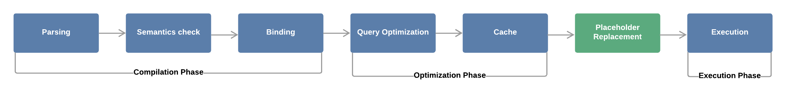
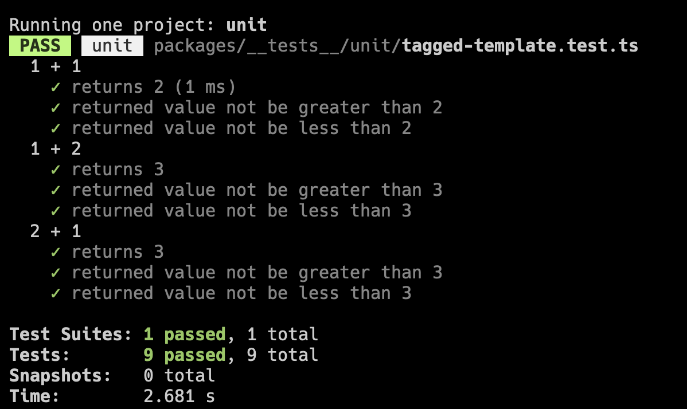
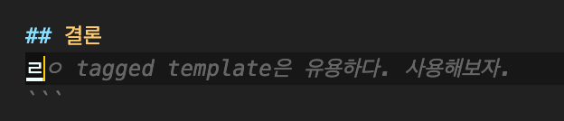

## Table of contents

## template literal

> ES6에서 도입된 새로운 문자열 표기법이고, 따옴표 대신 백틱을 사용하고, 문자열 안에 변수를 삽입할 수 있다. 그리고 multi-line string을 지원한다. 즉, \n없이도 여러 줄의 문자열을 표현할 수 있다.

template literal에 대해서 물어보면 위와 같이 대답을 하는 사람들이 많다.

하지만 [MDN](https://developer.mozilla.org/en-US/docs/Web/JavaScript/Reference/Template_literals) 에서는 지면의 절반 이상을 tagged template 설명에 쓰고 있다.

어쩌면 tagged template이 template literal의 핵심 아닐까?

## tagged template 이란?

템플릿 리터럴이 함수에 의해 태그된 걸 말한다.
태그 즉 이름표처럼 템플릿 리터럴 앞에 함수가 붙은 경우다.

```ts twoslash
function tagFunction(strings: TemplateStringsArray, ...values: any[]) {
  console.log("strings: ", strings);
  console.log("values: ", values);
}

const expression = "foo";

tagFunction`string text ${expression} string text`;
// strings: [ 'string text ', ' string text' ]
// values: [ 'foo' ]
```

템플릿 리터럴의 문자열과 표현식을 태그함수에게 인자로 전달된다.

태그함수에게 전달할 때, 표현식은 문자열로 변환하지 않고 그대로 전달한다. 덕분에 표현식으로 입력받은 값에대해 변환, 검증등의 로직을 적용하기 편하다.

포맷팅 된 리터럴을 그대로 함수의 인자로 전달하는 추상화를 통해, 결과적으로 문자열을 보다 직관적이고 안전하게 조작할 수 있게된다.

## Use Cases

실제로 SQL 쿼리, URL 생성, CSS, HTML 템플릿 생성, i18n 적용 등 다양한 곳에서 유용하게 사용된다.

대표적으로 동적으로 입력받은 문자열을 사용해 SQL 쿼리를 생성하는 경우를 생각해보자. tagged template을 사용하면 SQL 쿼리를 안전하게 생성할 수 있다.

### SQL injection

SQL 쿼리 생성 시 클라이언트로부터 동적으로 문자열을 입력받게된다. SQL injection은 이때 악의적인 의도의 쿼리를 입력해 실행하게끔 하는 공격이다.

Prepared Statement는 이런 시도를 막기위해 일반적으로 사용하는 전략이다.



_Oversimplified representation of SQL prepared statements processing_

> However, the query is already pre-compiled (Binding), so the final query will not go through compilation phase again. For this reason, the user-provided data will always be interpreted as a simple string and cannot modify the original query’s logic. Thus, the query will be immune to SQL Injection vulnerabilities for that data.

Prepared Statement의 경우 실행할 쿼리의 문법적인 분석을 미리 수행하고, 플레이스 홀더를 입력받은 값으로 대체한다.
따라서 악의적인 의도의 쿼리를 입력하더라도 문법적인 의미를 갖지 못하므로 공격을 방지할 수 있다.

구현을 위한 요구사항은 결국 두 가지:

- 입력받은 값을 위한 플레이스 홀더를 준비
- 입력받은 값은 별도로 전달

tagged template을 사용하면 쉽게 구현할 수 있다.

아래는 [`vercel/postgres`](https://vercel.com/docs/storage/vercel-postgres)의 구현 예시.

```ts twoslash
// packages/postgres/src/sql-template.ts
export type Primitive = string | number | boolean | undefined | null;

export function sqlTemplate(
  strings: TemplateStringsArray,
  ...values: Primitive[]
): [string, Primitive[]] {
  //...

  let result = strings[0] ?? "";

  for (let i = 1; i < strings.length; i++) {
    result += `$${i}${strings[i] ?? ""}`;
  }

  return [result, values];
}
```

작성된 테스트 케이스를 참고하면 더 명확하게 보인다.

```ts twoslash
// @filename: sql-template.ts
export type Primitive = string | number | boolean | undefined | null;

export function sqlTemplate(
  strings: TemplateStringsArray,
  ...values: Primitive[]
): [string, Primitive[]] {
  //...

  let result = strings[0] ?? "";

  for (let i = 1; i < strings.length; i++) {
    result += `$${i}${strings[i] ?? ""}`;
  }

  return [result, values];
}

// @filename: sql-template.test.ts
// ---cut---
// packages/postgres/src/sql-template.test.ts
import { sqlTemplate } from "./sql-template";

const validCases = [
  {
    input: sqlTemplate`SELECT * FROM users WHERE id = ${123}`,
    output: ["SELECT * FROM users WHERE id = $1", [123]],
  },
  {
    input: sqlTemplate`SELECT * FROM users WHERE id = ${123} AND name = ${"John"}`,
    output: ["SELECT * FROM users WHERE id = $1 AND name = $2", [123, "John"]],
  },
  {
    input: sqlTemplate`SELECT * FROM users WHERE name = ${"John; DROP TABLE users;--"}`,
    output: [
      "SELECT * FROM users WHERE name = $1",
      ["John; DROP TABLE users;--"],
    ],
  },
  {
    input: sqlTemplate`SELECT * FROM users WHERE name = ${"John AND 1=1"}`,
    output: ["SELECT * FROM users WHERE name = $1", ["John AND 1=1"]],
  },
];
```

이 외에도 여러 라이브러리들에서 다양한 use case를 볼 수 있다.

### styled-components

[styled-components](https://styled-components.com/) 는 리터럴로 작성된 CSS를 tagged template으로 처리한다.

```tsx twoslash {5-8, 18}
import styled from "styled-components";

const accentColor = "red";

const H1 = styled.h1`
  color: ${accentColor};
  font-size: 4rem;
`;

function App() {
  return (
    <div>
      <H1>Styled Components</H1>
    </div>
  );
}

type WhoAmI = Parameters<typeof styled.h1>;
//        ^?
```

`styled.h1`의 parameter 타입을 눈을 크게 뜨고 보면 ...

`[first: TemplateStringsArray, ...rest: Interpolation<...>[]]`

tagged template에서 건내주는 argument를 받게 되어있다.

### jest

[jest](https://jestjs.io/) 에서는 [Table-driven test](https://go.dev/wiki/TableDrivenTests)를 위해 tagged template을 사용할 수 있는데,
테스트 케이스를 무려 markdown 문법의 테이블로 작성할 수 있다.

| a    | b    | expected |
| ---- | ---- | -------- |
| ${1} | ${1} | ${2}     |
| ${1} | ${2} | ${3}     |
| ${2} | ${1} | ${3}     |

이 테이블을 그대로 테스트 케이스로 사용할 수 있다.

```ts twoslash {3-9}
import { describe, test, expect } from "@jest/globals";

describe.each`
  a    | b    | expected
  ---- | ---- | --------
  ${1} | ${1} | ${2}
  ${1} | ${2} | ${3}
  ${2} | ${1} | ${3}
`("$a + $b", ({ a, b, expected }) => {
  test(`returns ${expected}`, () => {
    expect(a + b).toBe(expected);
  });

  test(`returned value not be greater than ${expected}`, () => {
    expect(a + b).not.toBeGreaterThan(expected);
  });

  test(`returned value not be less than ${expected}`, () => {
    expect(a + b).not.toBeLessThan(expected);
  });
});
```



잘된다.

이 외에도 [i18n 적용](https://www.angular.kr/api/localize/init/$localize), [sanitize html](https://wesbos.com/sanitize-html-es6-template-strings), [graphql](https://github.com/apollographql/graphql-tag) 등 다양한 곳에서 문자열을 처리할 때 tagged template을 사용할 수 있고 유용하다.

---

코파일럿 가라사대:



---

## Reference

- [How to Prevent SQL Injection Vulnerabilities](https://www.securityjourney.com/post/how-to-prevent-sql-injection-vulnerabilities-how-prepared-statements-work)
- [Magic of Tagged Templates Literals in JavaScript?](https://medium.com/@patelhemil/magic-of-tagged-templates-literals-in-javascript-e0e2379b1ffc)
