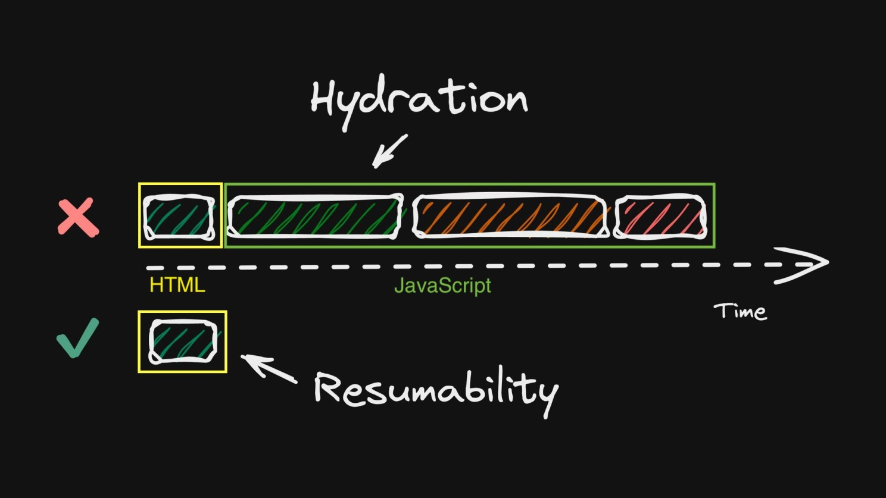
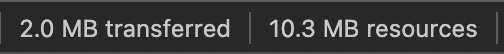

# stackblitz integration

StackBlitz 임베딩하는 best practice를 찾아보다가 발견한 아티클:

https://thenewstack.io/how-to-build-embed-components-with-astro-qwik-and-stackblitz/

StackBlitz나 CodeSandBox는 브라우져 탭 메모리에 IDE, 터미널을 로드해서 프로젝트를 실행한다.
프로젝트가 커지면 브라우져가 느려지고, 모바일 환경처럼 메모리가 더 제한된 환경에서는 탭이 죽을 수도 있다.

StackBlitz는 `clickToLoad` 옵션을 제공하고 있어서, 사용자가 클릭할 때만 프로젝트를 로드하도록 할 수 있다.

이 아티클에서는 qwik 이라는 프레임워크의 `useVisibleTask$` 라는 API를 사용해서,

`clickToLoad` 옵션보다 더 나아가서 StackBlitz sdk 요청 자체를 늦추고, 최대한 최초 페이로드와 메모리 사용량을 경량화하는 방법을 소개한다.

## qwik, resumability

리액트에서의 SSR은 다음의 과정을 거친다:

1. 서버사이드에서 컴포넌트를 렌더링
2. 렌더링한 결과와 JS 번들을 클라이언트에게 전달
3. 클라이언트에서 전달받은 렌더링 결과와 JS 번들을 이용해 hydration

이때 hydration 이 끝나기 전까지는 상호작용이 불가능하다.

그리고 이 과정은 결국 트리의 모든 노드(=컴포넌트=n개)들을 순회해야하고, O(n)의 시간복잡도를 가지게된다.

qwik은 tree가 아닌 hashmap으로 자신들의 방식을 비유하는데, 순회가 필요없이 O(1)의 시간복잡도로 상호작용이 가능하다고 한다.[^1]

당연히 실행에 필요한 JS 페이로드를 전송, 파싱하는 과정이 필요할텐데 qwik에서는 가능한 모든 것을 lazy 하게 요청한다.

이벤트가 발생하면 그때 핸들링 로직을 가져오는 식.



qwik 개발자들은 이 클라이언트에서 바로 상호작용이 가능한 방식을 hydration과 구분해서 resumable하다고 표현한다.

그리고 `useVisibleTask$`는 해당 qwik 컴포넌트가 뷰포트에 보이는 경우에 비동기적으로 로직 실행해주는 qwik의 API다.

아티클에서는 이런 특징들을 이용해서 stackblitz 프로젝트 구동에 필요한 스크립트를 최초 페이로드에서 최대한 덜어내고, 비동기적으로 로드하는 방식을 소개해준다.

구현은 엄청 간단한데, 문제는 astro 와의 integration 이슈: [@QwikDev#74](https://github.com/QwikDev/astro/issues/74)

`qwikdev()`의 옵션 중 `include`값을 주면 빌드를 못한다...

```ts
qwikdev(); // 됨
qwikdev({ include: "**/qwik/*" }); // 안됨
```

내 블로그의 경우 react 컴포넌트들이 있기 때문에, 각 jsx 컴포넌트를 어떤 프레임워크로 렌더링 할지 아래처럼 명시적인 설정이 필요했다.

```ts {4,5}
// astro.config.ts
export default defineConfig({
  //...
  integrations: [
    react({ include: "**/react/*" }),
    qwikdev({ include: "**/qwik/*" }),
    //...
  ],
});
```

아티클 저자는 블로그 리포지토리를 보니까, react 나 다른 jsx프레임워크와의 integration이 없이 qwik 만 사용하고 있어서 이 이슈를 겪지 않은 듯...

아쉽지만 qwik는 나중에 다시 해보기로 하고, 스크롤이 닿았을 때만 sdk를 요청하도록 `React.lazy`와 `react-intersection-observer`로 구현해봤다.

그리고 `clickToLoad`로 클릭 시에 프로젝트를 실행하도록 했다.

<StackBlitz id="2wheeh/simple-rsc" clickToLoad client:load />

네트워크 탭을 보니 스크롤이 닿은 후에만 chunk를 잘 로드하고 있다.

현재 이 페이지의 네트워크 페이로드

| 최초 페이로드             | 스크롤 닿은 후          | 프로젝트 실행             |
| ------------------------- | ----------------------- | ------------------------- |
|  |  |  |

## Footnotes

[^1]: https://www.builder.io/blog/hydration-tree-resumability-map
